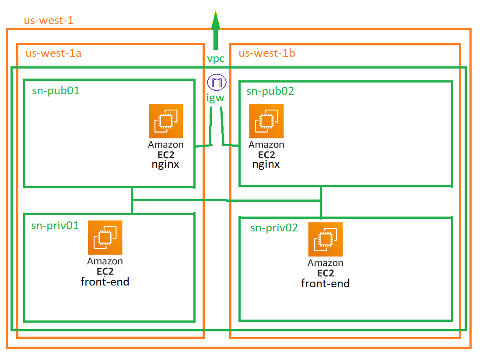

# EXERCÍCIOS AVANÇADOS (AULA 5)

Todos devem ser feitos em us-west-1

Caso ainda não tenha, crie seu projeto no GITHUB

7 - Aula 5 Stacks/Templates/Módulos Aninhados Provisioner

Caso não tenha a possibilidade de instalar aplicativos, use o cloudshell para executar

Obs: Use o git clone para baixar seu projeto

## Exercício 1 - Separação

Separe os exercícios da última aula em módulos ou stacks aninhados.

1. ESTRUTURA: Se usar Terraform, crie o bucket para os estados do projeto.

2. VPC: Concentre a criação da sua VPC neste módulo.

3. FRONTEND: Crie aqui o FRONTEND e o LOADBALANCER (Nginx)

## Exercício 2 - Referências entre módulos

- Ajuste os Outputs da VPC para que sejam usados pelo backend e frontend.

- Ajuste o frontend para usar os parâmetros enviados pela VPC

## Exercício 3 - Configure o user data para instalar nginx

- Instale o nginx na EC2 front-end usando o parâmetro user-data

# EXERCÍCIOS (AULA 6)

## Exercício 1

- Verifique se seu usuário da AWS possui permissão de s3:CreateBucket usando o comando de simulate policy

## Exercício 2

- Crie, no seu projeto, um modulo terraform para front-end e back-end.

## Exercício 3 - Configure o user data para instalar nginx

- Instale o nginx na EC2 loadbalancer usando o parâmetro user-data

